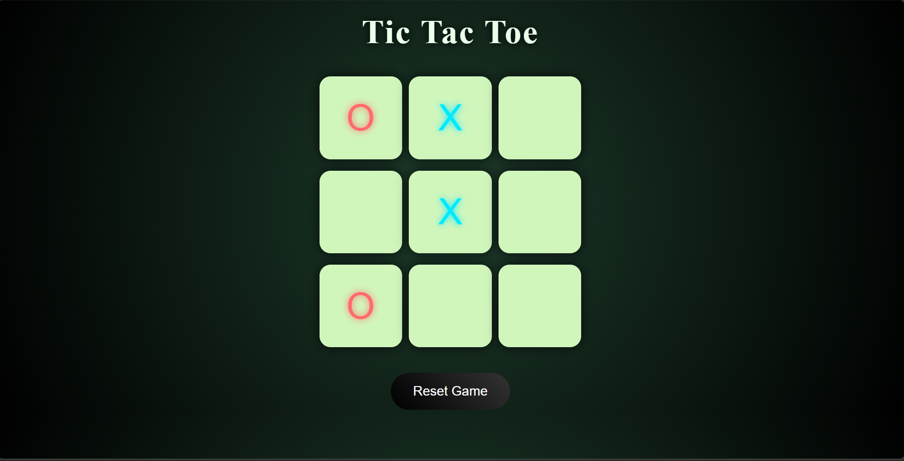

# 🎮 Tic Tac Toe Game

A modern and interactive Tic Tac Toe game built using **HTML, CSS, and JavaScript**.  
This project features smooth UI, sound effects, animations, and responsive design.

---

## 🚀 Live Demo
👉 tic-tac-toe-javascript-ochre.vercel.app

---

## ✨ Features

- 🎯 Player vs Player gameplay
- 🔊 Click sound effects
- 🏆 Winner detection with highlight
- 😐 Draw detection
- 🔄 Reset & New Game functionality
- 🎨 Modern UI with gradient background
- ✨ Hover & click animations
- 💡 Clean and beginner-friendly code

---

## 🛠️ Tech Stack

- HTML5  
- CSS3  
- JavaScript (Vanilla JS)

---

## 📸 Preview

<!-- Add your screenshot here -->

